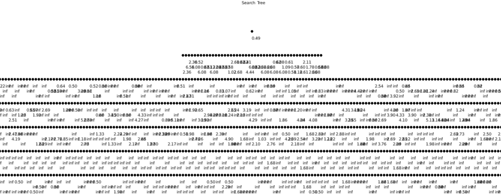

<div style="display:flex; justify-content:center">
    
</div>

[](https://opensource.org/licenses/MIT)

# Brocciu

*Be Ready for the Only Clever Chess Engine that remains Irrefutably Unbeaten*

**Brocciu** is a simple interface to access the [Lichess-Api](https://lichess.org/api) programmatically. It lets a custom bot engine intercept incoming challenges and react to them in parallel using a threadpool. Additionally, it comes with a simple chess engine written in [Rust](https://www.rust-lang.org) that implements the [Monte-Carlo-Tree-Search](https://en.wikipedia.org/wiki/Monte_Carlo_tree_search) algorithm using the straight-forward (but slow) ```Rc<RefCell<Node>>``` data structure. 

*The discussion on [Graphs and arena allocation](https://github.com/nrc/r4cppp/blob/master/graphs/README.md) outlines more performant (and complex/unsafe) graph data structure solutions. Additionally, [this](https://github.com/zxqfl/mcts) crate implements a more efficient parallelized tree search than the one provided here.*

The generated DAG can be visualized using the ```brocciu::utils::graph_visualization::draw_graph``` function. Due to its exponential nature, the following depicts a cropped version without the connections, where each black dot represents a unique chess board annotated with its corresponding UCT value. The image resolution arises from huge plotting times for thousands of graph nodes.

<div style="display:flex; justify-content:center; overflow: hidden">
    
</div>

### Performance
Runs approximately $5-10$k MCTS iterations/s depending on the current board position on WSL2 with a i5-5200U CPU. ```assets/flamegraph.svg``` indicates that the bottleneck lies in the simulation step (takes around $60\%$ of the compute budget). 

### Usage
#### Api config setup
In the json file ```/configs/default_api.json```, enter your lichess username and token. The token can be obtained by following the [bot instructions](https://lichess.org/api#tag/Bot/operation/botAccountUpgrade). Subsequently, rename the file to ```/configs/api.json```. 

#### Simple Example
Use the provided example chess engine:
```rust
use brocciu;
use tokio;

// Create a runtime environment
#[tokio::main]
async fn main(){
    // Run brocciu
    brocciu::main().await;
}
```

#### TODO: Advanced Example
Use your own engine, by letting it implement the ```Engine``` trait:
```rust
use brocciu;
use tokio;

struct MyEngine{}

/* The Engine trait

pub trait Engine{
    fn new(game: Rc<RefCell<chess::Game>>) -> Self;
    fn get_next_move(&mut self, bot_color: chess::Color) -> Result<(String, bool), NoAvailableMoveError>;
}

*/

impl brocciu::mcts::search::Engine<MyEngine> for MyEngine{
    pub fn new(game: Rc<RefCell<chess::Game>>) -> MyEngine {
        // Your implementation
    }
    pub fn get_next_move() -> Result<(String, bool), brocciu::mcts::search::NoAvailableMoveError>{
        // Your implementation
    }
}

// Create a runtime environment
#[tokio::main]
async fn main(){
    // Run brocciu

    brocciu::run()
}
```

### Feature Tracking
This project only offers the most bare-bone features necessary for functionality. The following features have yet to be implemented
State | Comment 
---|---
:x: | **Selection Policy**: Currently only UCT -> Add more refined node selection policies
:x: | **Simulation Policy**: Currently random self-play -> Add more refined node simulation policies (e.g. with NNs)
:x: | **Simulation Time Dynamization**: Currently, each move generation takes a constant amount of time except when reaching fully explored tree states -> Allocate different search time budgets at different game stages
:x: | **Simulation Break Condition**: Currently constant depth break condition -> Break simulate step when position obviously leads to stalemate
:x: | **Challenge Initiation**: Currently, bot can only react to exogeneous challenges -> Initiate challenges against the computer
:x: | **Challenge Types**: Currently, only regular untimed challenge types supported. Non-standard (and timed) challenges result in undefined behavior -> Accept different challenge types;
:x: | **Tree Data Structure**: Current node data structure is ```Rc/Weak<RefCell<Node>>``` -> Use a more efficient node data structure
:x: | **Profiling/Performance**: Currently, the simulation step takes $60\%$ of the compute budget -> Review simulation end conditions 
:x: | **Spurious Zobrist Hash Collisions**: Currently, each node is maximally expanded once. A hash collision occuring in the game's path leads to panicking -> Review better recovery options
:x: | Other 

### Contributing
Pull requests are welcome. Please open an issue to describe the desired feature. No ETA implied.